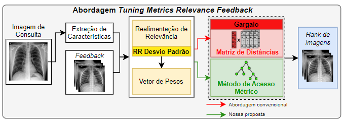
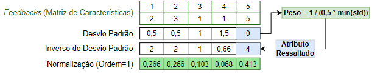
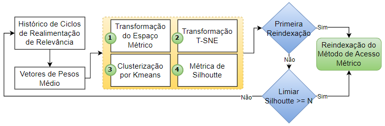

# Tuning Metrics Relevance Feedback
 Repositório referente ao artigo Calibração de Distância em Método de Acesso Métrico  

<h1>Sobre</h1>
 No artigo "Calibração de Distância em Método de Acesso Métrico" desenvolvemos uma metodologia que demonstra a inclusão de funções de distâncias ponderadas em estruturas de indexação como Métodos de Acesso Métrico (MAM), mais especificamente a Slim-Tree. Este artigo é relevante, pois os MAMs utilizam funções de distância para realizar a construção da árvore métrica, gerando uma indexação baseada na distância entre os elementos da base, o que por sua vez impede que um MAM consiga indexar os elementos utilizando duas ou mais funções de distância na mesma indexação (pois são obtidos espaços métricos diferentes). Um vetor de pesos corretamente aprendido (Realimentação de Relevância), permite aprimorar a semântica dos dados, melhorando assim a acurácia e precisão das consultas por similaridade. Desta forma, permitir o uso de funções de distância ponderadas em um MAM, que reajusta o formato de busca dos algoritmos de consultas por similaridade como KNN e Range, irá ajudar a melhorar a precisão dos resultados da consulta, reduzindo o impacto de elementos irrelevantes em uma consulta por similaridade. Além disso, é possível fazer uso da eficácia de recuperação da estruturas de MAMs sendo  mais rápido em relação a estratégias sequenciais que utilizam matriz de distâncias.

<h1> Métodos de avaliação </h1>
Os métodos de avaliação foram a Mean Precision Average e Acurácia (validação cruzada) sobre três bases de dados (COREL1000, Kaggle-COVID BUSI-Breast) em complemento da análise qualitativa com visualização T-SNE do espaço métrico transformado. 

<h1>Metodologia</h1>

Utilização de Métodos de Acesso Métrico por meio de Realimentação de Relevância 

Algoritmo revisado RR Desvio Padrão

Metodologia de reindexação do Método de Acesso Métrico

<h1>Base de Dados e Extratores</h1>
Extratores de Características: <a href="https://github.com/giakou4/pyfeats">https://github.com/giakou4/pyfeats</a>

COVID-19 Radiography Database: <a href="https://www.kaggle.com/datasets/tawsifurrahman/covid19-radiography-database" target="_blank">https://www.kaggle.com/datasets/tawsifurrahman/covid19-radiography-database</a>
BUSI-BREAST Database: <a href="https://www.kaggle.com/datasets/aryashah2k/breast-ultrasound-images-dataset" target="_blank">https://www.kaggle.com/datasets/aryashah2k/breast-ultrasound-images-dataset</a>
COREL-1000 Database: <a href="https://www.kaggle.com/datasets/elkamel/corel-images" target="_blank">https://www.kaggle.com/datasets/elkamel/corel-images</a>
 

